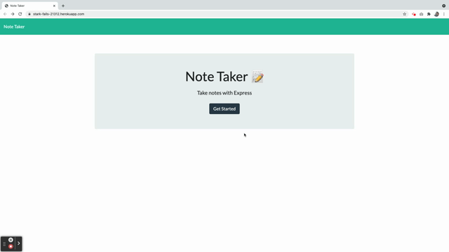

# note_taker

## Description
A note-taking app for helping you stay organized.

## Technologies
* HTML
* CSS
* [Bootstrap](https://getbootstrap.com/)
* JavaScript
* Node.js
* [Express](https://expressjs.com/)
* [uuid](https://www.npmjs.com/package/uuid)

## Installation
To install the necessary dependencies to run this application on your local machine:

npm i

## Demo

## License
Copyright &copy; Licensed under the MIT license.

## Questions
Contact me at kaytemcdonough@gmail.com with questions.